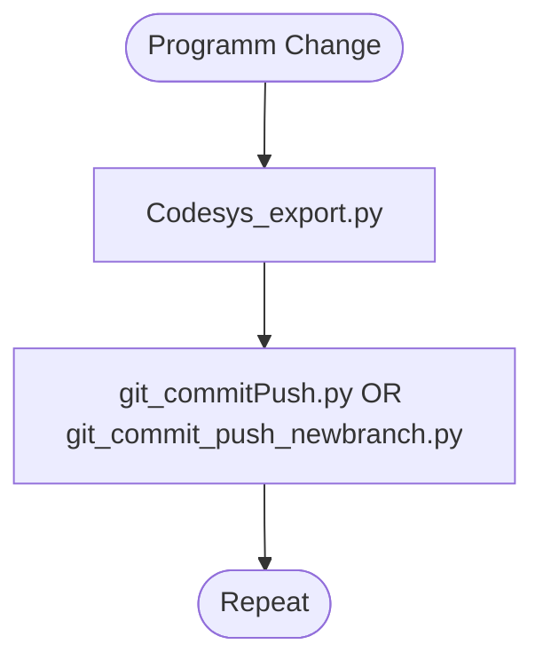

## Version Control for Codesys Projects

1. Edit gitconfig.txt to your repo an your name, this has to be Part of the folder which contains the .project file.

3. run scripts after changes and commit

The Export is for Read-ability and for tracing the changes in code

1. Open Script and write commit message
   

